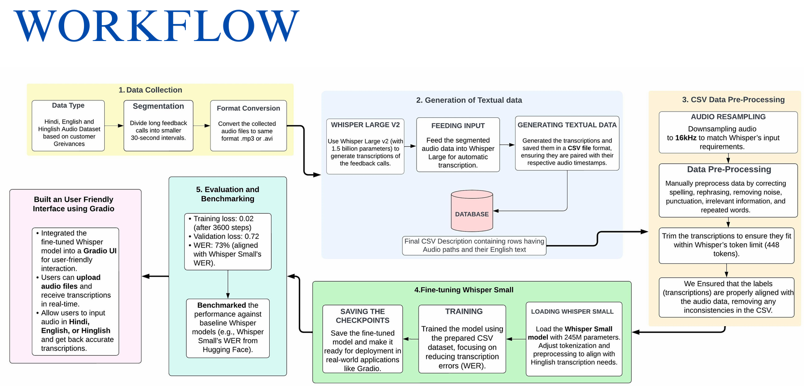

# Fine-tuning Open Source Whisper (Speech-to-Text) Model

## Overview
For the **DARPG Hackathon 2024**, **Problem Statement 3** involved evaluating and optimizing an Open Source speech-to-text model to accurately transcribe feedback calls related to citizen grievances into English text.

Since the textual output data was not provided, **Whisper LLM** was used to generate textual data for each audio dataset. This data was then stored in a `metadata.csv` file and, after preprocessing, was used to fine-tune the **Whisper Small LLM**.

### Project Explanation Video
Here's a YouTube video explaining our project: [Watch our project explanation on YouTube](https://youtu.be/qPTS3mdLkAY?si=SXOdFyvT-Hlq8QqY)

---
## Dataset Preparation
Prepare your **Audio** folder in the following format:

```
audio_dataset/
├── metadata.csv
└── data/
```

- **`metadata.csv`** contains the names of the audio files, their `audio_path`, and their corresponding transcriptions.
- **`data/`** folder contains all the audio files.

---
## Hackathon Workflow
### These are all the steps we followed during the hackathon:



### Steps:
1. **Data Collection**
   - Gathered Hindi, English, and Hinglish audio datasets based on customer grievances.
   - Segmented long feedback calls into smaller 30-second intervals.
   - Converted audio files to the same format (**MP3**/**WAV**).

2. **Generation of Textual Data**
   - Used **Whisper Large v2** (1.5 billion parameters) to generate transcriptions.
   - Transcriptions were stored in a CSV file, ensuring alignment with audio timestamps.

3. **CSV Data Pre-Processing**
   - **Audio Resampling**: Converted audio to **16kHz** to match Whisper’s input requirements.
   - **Data Cleaning**: Removed noise, punctuation, irrelevant words, and rephrased text.
   - **Trimming**: Ensured transcriptions fit within Whisper’s **448-token limit**.
   - **Alignment**: Verified that text labels matched audio timestamps.

4. **Fine-tuning Whisper Small**
   - Used the preprocessed CSV dataset to train the **Whisper Small** model (**245M parameters**).
   - Adjusted tokenization to improve **Hinglish transcription**.
   - Saved checkpoints for deployment.

5. **Evaluation & Benchmarking**
   - **Training Loss:** **0.02** (After 3600 steps)
   - **Validation Loss:** **0.72**
   - **WER:** **73%** (Aligned with Whisper Small’s benchmark WER from Hugging Face)
   - Compared our fine-tuned model's performance against baseline Whisper models.

6. **Deployment & UI Integration**
   - Integrated the fine-tuned model into a **Gradio UI** for user-friendly interaction.
   - Users can upload audio files and receive transcriptions in **real time**.
   - Supports Hindi, English, and Hinglish input.

---
## Deployment
We have deployed this model on **Hugging Face Spaces** for easy access and usage. You can try it out here:

👉 **[WHISPER-SPEECH-TO-TEXT-MODEL-FOR-DARPG](https://huggingface.co/spaces/sanket003/WHISPER-SPEECH-TO-TEXT-MODEL-FOR-DARPG)**

---
## Using the Model Locally
To use the model locally, run the `run_model.py` script, which contains a **Gradio interface** for easy interaction with the model.

```bash
python run_model.py
```

---
### Results: WER per Iteration
| Step  | Training Loss | Validation Loss | WER    |
|-------|--------------|----------------|--------|
| 300   | 0.937000     | 1.076489       | 111.138 |
| 600   | 0.665400     | 1.034178       | 110.390 |
| 900   | 0.439400     | 1.082848       | 92.046  |
| 1200  | 0.316200     | 1.159689       | 81.241  |
| 1500  | 0.179000     | 1.270340       | 79.797  |
| 1800  | 0.120500     | 1.355752       | 80.456  |
| 2100  | 0.050800     | 1.500271       | 77.532  |
| 2400  | 0.036000     | 1.569484       | 80.511  |
| 2700  | 0.023300     | 1.649961       | 77.720  |
| 3000  | 0.017700     | 1.707841       | 77.338  |
| 3300  | 0.012600     | 1.766127       | 73.134  |
| 3600  | 0.009500     | 1.823766       | 75.251  |
| 3900  | 0.006000     | 1.872765       | 76.086  |

---
## Contributors
- **[Sanket Poojary]** - *Lead Developer*
- **[Priyadarshi Uttpal]** - *Lead developer*


For inquiries, contact us at **[priyadarshiutpal06@gmail.com](mailto:priyadarshiutpal06@gmail.com)**

---
### License
This project is licensed under the **MIT License** - see the `LICENSE` file for details.

---
Thank you for checking out our project! 🚀

